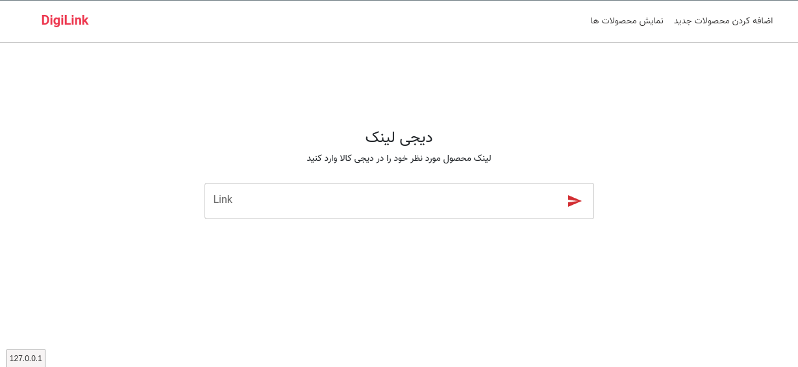
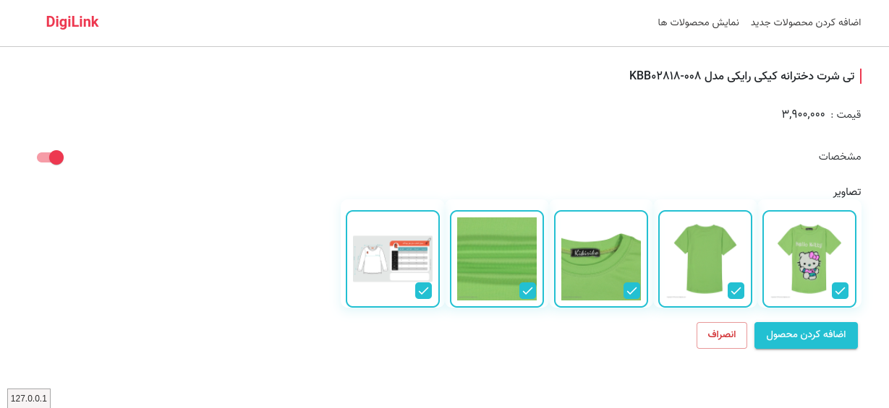
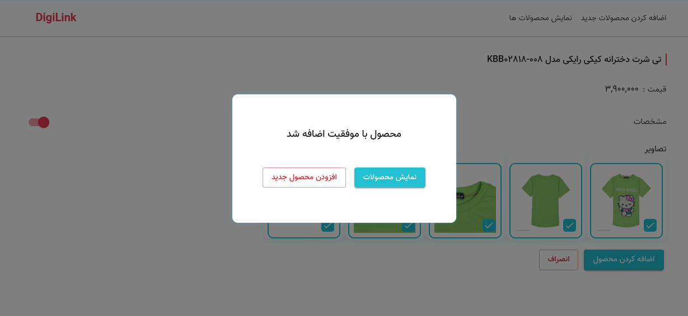
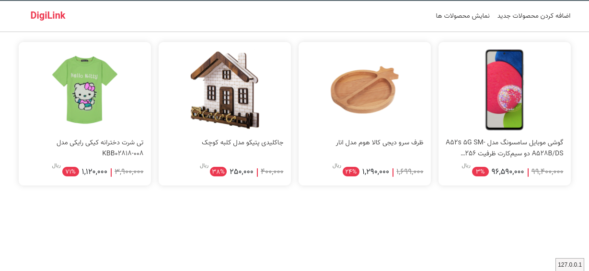
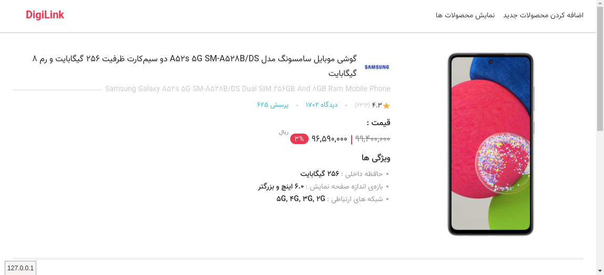

For working project you should install json-server with npm

### `npm i json-server`

After installation

### `json-server --watch db.json --port 8080` Enter in the terminal

and

Copy <a href="#">this file<a/> to localhost

### `Screenshots`

    
    
    
    
    

